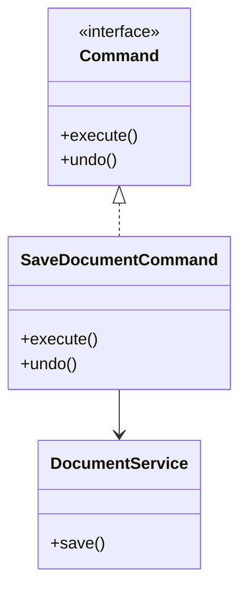

# Command Pattern

The Command pattern turns a request into an object. This lets code queue it, log it, retry it, undo it, or pass it around without knowing the details of the receiver.

## Why It Matters

Command is useful when "doing the action now" and "describing the action" should be separated.

## Core Concepts

Typical pieces:

- Command interface with `execute`.
- Optional `undo` for reversible actions.
- Concrete command that stores the data needed to perform the action.
- Invoker that triggers the command.
- Receiver that performs the actual work.

## Example

```text
Button click -> SaveDocumentCommand -> DocumentService.save()
```



## When To Use

- Undo/redo history.
- Task queues.
- Audit logs for actions.
- Scheduling actions for later.
- Decoupling UI controls from business operations.

## Common Mistakes

- Creating a command object for every tiny method call.
- Mixing command execution with UI state.
- Implementing `undo` without storing enough previous state.

## Related Topics

- [Design Patterns](index.md)
- [Transaction Idempotency](transaction-idempotency.md)

## References

- Refactoring Guru command pattern: <https://refactoring.guru/design-patterns/command>
- Game Programming Patterns command: <https://gameprogrammingpatterns.com/command.html>
- Java Design Patterns command: <https://java-design-patterns.com/patterns/command/>
