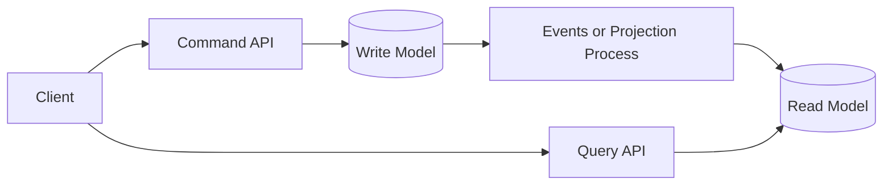

# CQRS

CQRS stands for Command Query Responsibility Segregation. It separates write operations from read operations.

## Why It Matters

In some systems, the model used to update data is not the best model for reading data. CQRS allows each side to be optimized separately.

## Core Concepts

- Command: changes state.
- Query: reads state and does not change it.
- Write model: validates business rules and persists changes.
- Read model: shaped for fast queries and user-facing views.

## When To Use

- Read and write workloads have very different shapes.
- Query performance needs denormalized views.
- The domain has complex business rules on writes.
- Event sourcing or projections are already useful.

## When To Avoid

- Simple CRUD applications.
- Small systems where one model is easy to understand.
- Teams that do not need eventual consistency.

## Common Mistakes

- Adopting CQRS just because microservices are being used.
- Forgetting that read models may be eventually consistent.
- Duplicating models without a real performance or complexity benefit.
- Making every query and command a separate service.

## Related Topics

- [Design Patterns](index.md)
- [Transaction Idempotency](transaction-idempotency.md)

## References

- Martin Fowler on CQRS: <https://martinfowler.com/bliki/CQRS.html>
- Microservices.io CQRS pattern: <https://microservices.io/patterns/data/cqrs.html>
