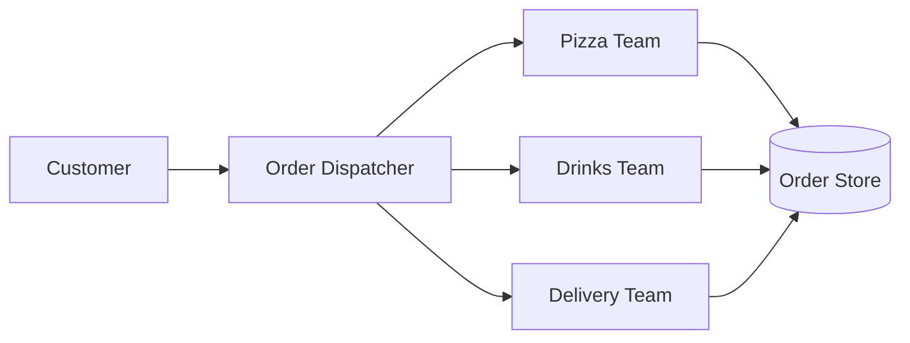

# System Design Foundations

System design starts with a simple question: how should a software system keep working as users, traffic, data, and failure scenarios grow?

## Why It Matters

A small application can run on one machine. A production system usually needs to handle higher load, tolerate failures, protect data, and remain understandable to engineers.

## Core Concepts

### Vertical Scaling

Vertical scaling means using a bigger machine: more CPU, memory, disk, or network capacity.

Use it when:

- The system is simple enough to run on one machine.
- The bottleneck can be solved by stronger hardware.
- Operational simplicity matters more than maximum scale.

Limits:

- Hardware has an upper bound.
- A single machine can become a single point of failure.
- Large machines can be expensive.

### Horizontal Scaling

Horizontal scaling means adding more machines and distributing work across them.

Use it when:

- Traffic is higher than one machine can comfortably handle.
- You need redundancy.
- The workload can be split across multiple nodes.

Tradeoffs:

- You usually need load balancing.
- Data consistency becomes harder.
- Network calls introduce latency and failure modes.

### Distributed Systems

A distributed system is a group of machines that cooperate to behave like one system from the user's point of view.

Common components:

- Load balancers
- Application servers
- Databases
- Caches
- Queues
- Observability tools

Distributed systems improve scale and resilience, but they also introduce coordination, latency, retries, partial failure, and consistency challenges.

## Example

A pizza shop is a useful mental model:

- One chef working harder is vertical scaling.
- Multiple chefs serving orders is horizontal scaling.
- Dedicated teams for pizza, drinks, and delivery resemble service decomposition.
- A dispatcher deciding which chef handles an order resembles a load balancer.

## HLD and LLD

High-level design focuses on the system shape:

- Components
- Data flow
- Scaling strategy
- Fault tolerance
- External integrations

Low-level design focuses on implementation details:

- Classes
- Interfaces
- Methods
- Data structures
- Module boundaries

## Common Mistakes

- Choosing microservices before the problem requires distribution.
- Scaling the application while ignoring the database bottleneck.
- Assuming adding servers automatically improves consistency.
- Designing only for the happy path and ignoring failure behavior.

## Related Topics

- [Stateful and Stateless Architecture](stateful-stateless.md)
- [Multi-Tenant Architecture](multi-tenant-architecture.md)
- [Design Patterns](design-patterns/index.md)

## References

- System Design Primer: <https://github.com/donnemartin/system-design-primer>
- Gaurav Sen system design playlist: <https://www.youtube.com/playlist?list=PLMCXHnjXnTnvo6alSjVkgxV-VH6EPyvoX>
