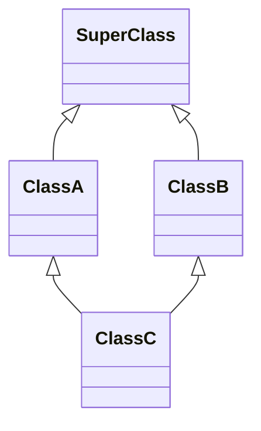

# Object-Oriented Programming

Object-Oriented Programming organizes software around objects that combine data and behavior.

## Why It Matters

OOP is still common in backend systems, frameworks, domain modeling, and design-pattern discussions. Understanding it helps with low-level design and maintainable code.

## Core Concepts

### Encapsulation

Keep internal state private and expose behavior through clear methods.

### Abstraction

Expose what callers need and hide unnecessary details.

### Inheritance

Reuse or specialize behavior through parent-child relationships.

### Polymorphism

Use a common interface while allowing different implementations.

## Diamond Problem

The diamond problem happens when a class inherits from two classes that both inherit from the same parent.

The ambiguity is: if `ClassC` calls behavior from `SuperClass`, which inheritance path should be used?

Different languages handle this differently:

- Java avoids multiple class inheritance and uses interfaces.
- C++ supports multiple inheritance and requires rules to resolve ambiguity.
- Python uses method resolution order.

## Common Mistakes

- Using inheritance for code reuse when composition would be simpler.
- Creating deep inheritance trees that are hard to reason about.
- Exposing internal state through getters and setters without real behavior.
- Treating classes as database tables instead of behavior-focused models.

## Related Topics

- [UML](uml.md)
- [Domain-Driven Design](domain-driven-design.md)
- [Design Patterns](design-patterns/index.md)
