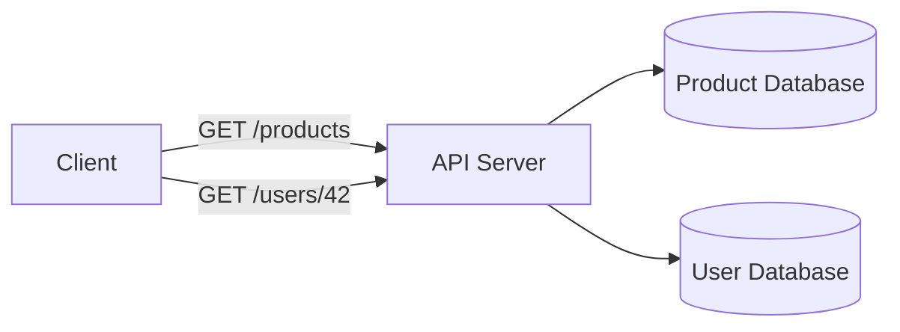

# REST

REST stands for Representational State Transfer. It is an architectural style for designing networked applications around resources, representations, and standard HTTP behavior.

## Why It Matters

REST is common for public APIs because it is easy to consume with browsers, HTTP clients, proxies, caches, and developer tools.

## Core Concepts

### Resource-Oriented Design

A REST API models important domain concepts as resources.

Examples:

```text
GET /users/42
GET /products
POST /orders
PATCH /orders/1001
```

### Uniform Interface

Clients interact with resources using consistent conventions:

- URIs identify resources.
- HTTP methods describe the operation.
- Status codes describe the result.
- Response bodies use a standard representation such as JSON.

### Client-Server Separation

The client and server can evolve independently as long as the API contract remains stable.

### Stateless Requests

Each request contains enough information for the server to process it. The server should not depend on hidden client session state from a previous request.

### Cacheability

Responses should make cache behavior explicit when possible through HTTP headers.

### Layered System

Clients do not need to know whether they are talking directly to the application server or through a proxy, gateway, cache, or load balancer.

## Example



## HTTP Status Code Groups

| Group | Meaning | Example |
| --- | --- | --- |
| 2xx | Success | `200 OK`, `201 Created` |
| 3xx | Redirection | `301 Moved Permanently` |
| 4xx | Client-side problem | `400 Bad Request`, `404 Not Found` |
| 5xx | Server-side problem | `500 Internal Server Error` |

## Common Mistakes

- Putting every action behind `POST /doSomething`.
- Returning `200 OK` for failures.
- Making server-side session state required for normal API behavior.
- Designing URLs around database tables instead of domain resources.
- Calling an API RESTful only because it returns JSON.

## Related Topics

- [HTTP, RPC, gRPC, and JSON-RPC](http-rpc-grpc-json-rpc.md)
- [SOAP](soap.md)
- [Stateful and Stateless Architecture](stateful-stateless.md)

## References

- Roy Fielding dissertation: <https://www.ics.uci.edu/~fielding/pubs/dissertation/rest_arch_style.htm>
- MDN HTTP response status codes: <https://developer.mozilla.org/en-US/docs/Web/HTTP/Status>
- Designing RESTful APIs course notes should be rewritten in your own words before adding detailed sections.
