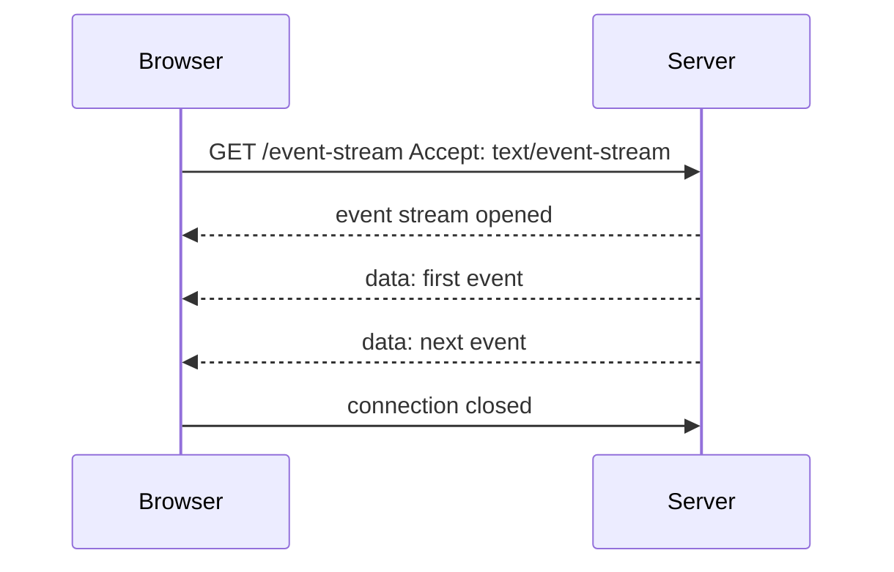

# Server-Sent Events

Server-Sent Events, or SSE, is a browser-supported mechanism for receiving a one-way stream of events from a server over HTTP.

## Why It Matters

SSE is useful when the server needs to push updates to the client, but the client does not need full bidirectional communication.

Good use cases:

- Notifications
- Live dashboards
- Progress updates
- Activity feeds
- Status changes

## Core Concepts

The browser opens a long-lived HTTP connection using `EventSource`.

```javascript
const source = new EventSource("/event-stream");

source.onmessage = (event) => {
  console.log(event.data);
};

source.onerror = (error) => {
  console.error("SSE error", error);
};
```

The server responds with:

```http
Content-Type: text/event-stream
```

Events are sent as UTF-8 text. Messages are separated by a blank line.

```text
event: order-updated
id: 1001
data: {"status":"paid"}

```

## Flow



## SSE vs WebSocket

| Need | SSE | WebSocket |
| --- | --- | --- |
| Server to client updates | Strong fit | Strong fit |
| Client to server streaming | Not a fit | Strong fit |
| Browser API simplicity | Very simple | More setup |
| Runs over normal HTTP | Yes | Uses protocol upgrade |
| Automatic reconnect | Built in | Must be handled by application |

## Common Mistakes

- Using SSE when the client must send frequent real-time messages back.
- Forgetting that browser connection limits can matter, especially over HTTP/1.1.
- Buffering events through proxies or servers that are not configured for streaming.
- Sending huge messages instead of small event updates.

## Related Topics

- [HTTP, RPC, gRPC, and JSON-RPC](http-rpc-grpc-json-rpc.md)
- [REST](rest.md)

## References

- MDN using server-sent events: <https://developer.mozilla.org/en-US/docs/Web/API/Server-sent_events/Using_server-sent_events>
- HTML Living Standard event stream format: <https://html.spec.whatwg.org/multipage/server-sent-events.html>
