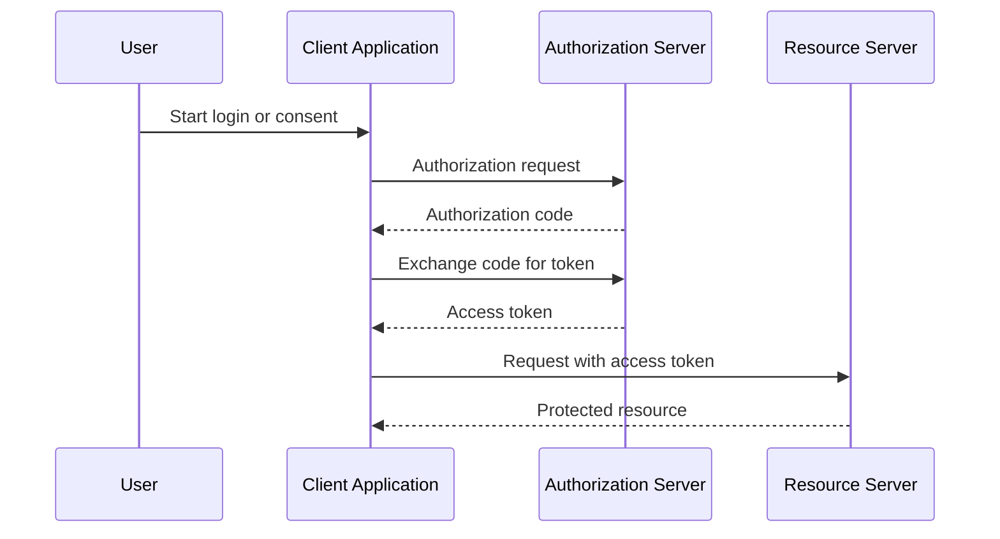

# Single Sign-On and OAuth

Single Sign-On lets a user authenticate once and access multiple applications. OAuth 2.0 is an authorization framework commonly used in SSO and delegated access flows.

## Why It Matters

Authentication and authorization are easy to mix up. System design discussions often involve identity providers, access tokens, user sessions, and logout behavior.

## Core Concepts

### SSO

Single Sign-On centralizes login through an identity provider.

Example:

1. User opens an application.
2. Application redirects the user to the identity provider.
3. User authenticates.
4. Identity provider returns a proof of authentication.
5. Application creates its own session or accepts the returned token.

### OAuth 2.0

OAuth is primarily about authorization: allowing a client application to access a protected resource with permission.

Common roles:

- Resource owner: the user.
- Client: the application requesting access.
- Authorization server: issues tokens.
- Resource server: hosts protected APIs.

### Front-Channel Logout

Front-channel logout uses the browser to redirect or notify applications that the user logged out.

Tradeoffs:

- Simple to understand.
- Depends on browser behavior.
- Can be less reliable if tabs, redirects, or network calls fail.

### Back-Channel Logout

Back-channel logout uses direct server-to-server communication between the identity provider and applications.

Tradeoffs:

- More reliable for coordinated logout.
- Requires applications to expose logout endpoints.
- More complex to implement.

## Common Mistakes

- Treating OAuth as authentication by itself.
- Storing access tokens insecurely in browser storage.
- Using long-lived tokens without rotation or revocation strategy.
- Forgetting logout behavior across multiple applications.

## Related Topics

- [Stateful and Stateless Architecture](stateful-stateless.md)
- [REST](rest.md)

## References

- OAuth 2.0 RFC: <https://www.rfc-editor.org/rfc/rfc6749>
- OpenID Connect: <https://openid.net/developers/how-connect-works/>
- DigitalOcean OAuth 2.0 introduction: <https://www.digitalocean.com/community/tutorials/an-introduction-to-oauth-2>
- AWS SSO overview: <https://aws.amazon.com/what-is/sso/>
