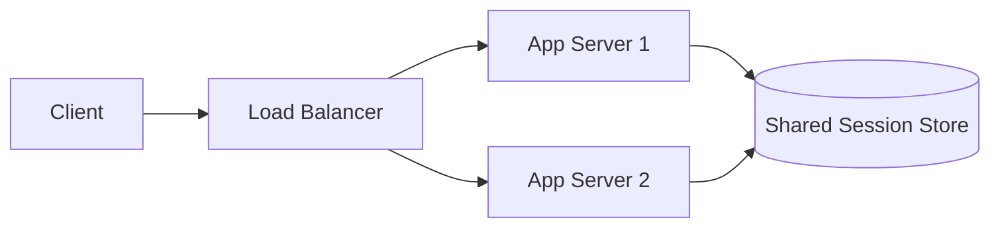
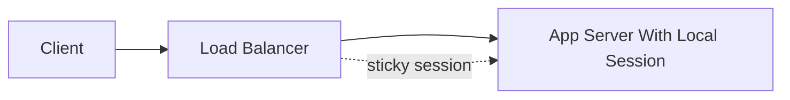

# Stateful and Stateless Architecture

A stateless component does not depend on local memory from previous requests to process the next request. A stateful component keeps information that affects future interactions.

## Why It Matters

Stateless services are usually easier to scale horizontally because any instance can handle any request. Stateful systems are often necessary, but they require careful placement of data and failure handling.

## Core Concepts

### Stateless HTTP

HTTP itself is stateless. Each request is independent from the protocol's point of view.

Applications add continuity through mechanisms such as:

- Cookies
- Session IDs
- Access tokens
- Server-side session stores
- URL rewriting in older systems

### JSESSIONID

`JSESSIONID` is a common Java web session identifier. It lets the browser send a session ID back to the server, usually through a cookie.

The actual session data may live:

- In memory on one application server
- In a shared cache such as Redis
- In a database
- In a signed token, depending on architecture

## Stateless Application Pattern

With a shared session store or self-contained token, the load balancer does not need to pin a user to one server.

## Stateful Application Pattern

This can work, but failures and deployments become harder because user state is tied to a specific server.

## Common Mistakes

- Saying an application is stateless while storing important user session data in local memory.
- Using sticky sessions as the only scaling strategy.
- Forgetting session expiration, rotation, and invalidation.
- Confusing protocol statelessness with application statelessness.

## Related Topics

- [REST](rest.md)
- [Single Sign-On and OAuth](sso-oauth.md)
- [System Design Foundations](foundations.md)
