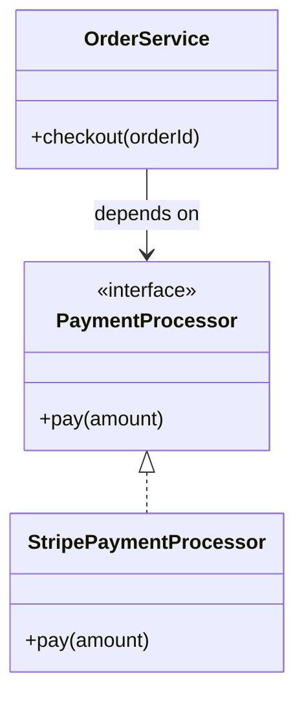

# UML

UML stands for Unified Modeling Language. It provides visual notation for describing relationships, behavior, and structure in software systems.

## Why It Matters

UML is useful when a diagram communicates design faster than prose. For interviews and design discussions, a simple class or sequence diagram is often enough.

## Core Relationships

| Relationship | Meaning | Plain-language hint |
| --- | --- | --- |
| Association | One class is connected to another | "uses" or "has a" |
| Inheritance | A class extends another class | "is a" |
| Realization | A class implements an interface | "fulfills a contract" |
| Dependency | A class temporarily uses another class | "needs it for this operation" |
| Aggregation | Whole-part relationship with independent lifetimes | "has a, but parts can live alone" |
| Composition | Whole-part relationship with tied lifetimes | "owns parts strongly" |

## Example

## Common Mistakes

- Making diagrams too detailed to read.
- Treating UML as mandatory ceremony instead of a communication tool.
- Confusing aggregation and composition when object lifetime does not matter for the discussion.
- Drawing inheritance when composition would better describe the design.

## Related Topics

- [Object-Oriented Programming](oop.md)
- [Domain-Driven Design](domain-driven-design.md)
